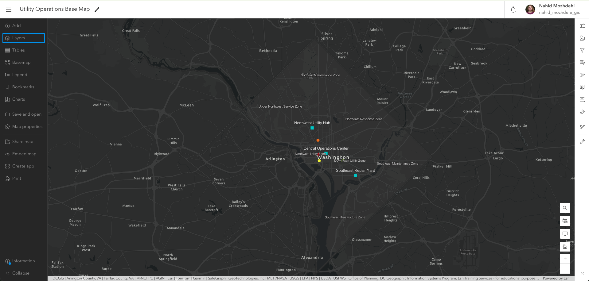
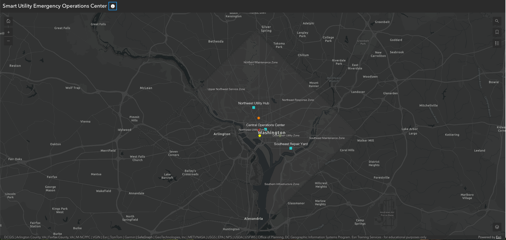
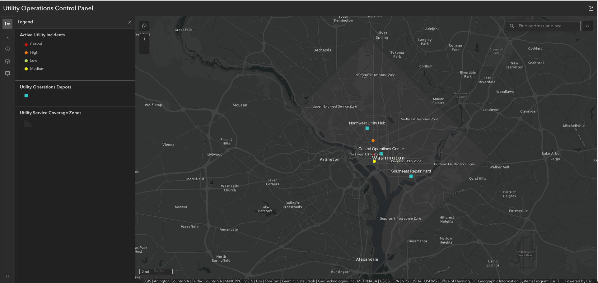
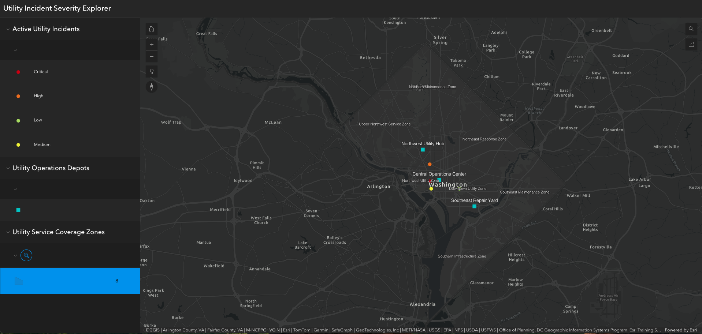
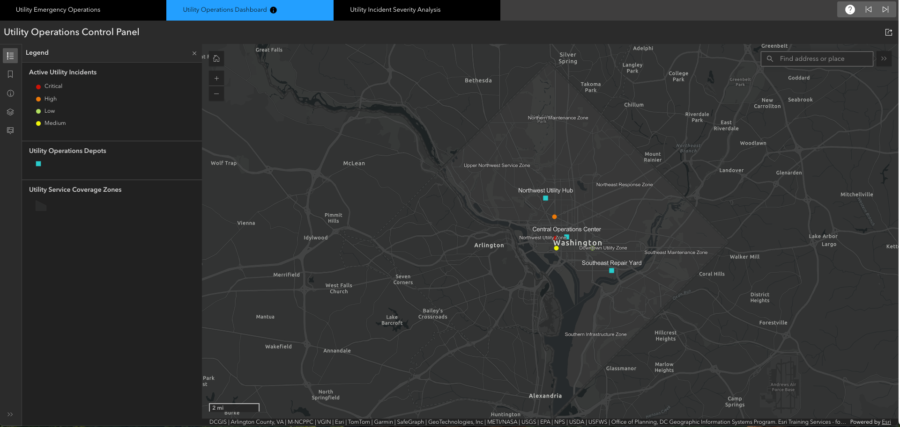

<h1>Smart Utility ArcGIS Operations Dashboard</h1>

<h2>ArcGIS Online Operational Web GIS Portfolio Project</h2>

This project demonstrates the design and implementation of a professional ArcGIS Online operational GIS environment for utility incident monitoring, emergency response coordination, and service coverage visualization.

The portfolio focuses on Web GIS configuration, operational cartography, GIS presentation workflows, and ArcGIS Instant Apps architecture using ArcGIS Online.

<h2>Live ArcGIS Online Portfolio</h2>

Access the live operational GIS portfolio application:

<a href="https://www.arcgis.com/apps/instant/portfolio/index.html?appid=ec7a48d385db43b1ae6ad2151c5f1cb4" target="_blank">
Open ArcGIS Operations Portfolio
</a>

The live ArcGIS Online portfolio includes:

<ul>
<li>Utility Emergency Operations application</li>
<li>Utility Operations Dashboard</li>
<li>Interactive Incident Severity Analysis</li>
<li>Operational Web GIS workflows</li>
<li>Interactive legend filtering</li>
<li>Sidebar operational dashboard</li>
<li>Portfolio-based GIS presentation architecture</li>
</ul>

<h2>Project Objectives</h2>

<ul>
<li>Design a clean operational Web GIS environment for utility monitoring</li>
<li>Demonstrate ArcGIS Online map configuration workflows</li>
<li>Build multiple ArcGIS Instant Apps for different operational use cases</li>
<li>Apply professional GIS cartographic design principles</li>
<li>Reduce map clutter while preserving operational visibility</li>
<li>Implement interactive GIS presentation workflows</li>
<li>Demonstrate public-facing GIS portfolio architecture</li>
</ul>

<h2>Technology Stack</h2>

<table border="1" cellpadding="8" cellspacing="0">
<tr>
<th>Component</th>
<th>Technology</th>
<th>Purpose</th>
</tr>

<tr>
<td>Web GIS Platform</td>
<td>ArcGIS Online</td>
<td>Operational GIS presentation and application hosting</td>
</tr>

<tr>
<td>Map Configuration</td>
<td>ArcGIS Map Viewer</td>
<td>Operational layer styling and configuration</td>
</tr>

<tr>
<td>Instant Apps</td>
<td>ArcGIS Instant Apps</td>
<td>Interactive GIS operational workflows</td>
</tr>

<tr>
<td>Data Source</td>
<td>CSV Operational Datasets</td>
<td>Utility incidents and depot locations</td>
</tr>

<tr>
<td>Version Control</td>
<td>Git + GitHub</td>
<td>Portfolio publishing and documentation</td>
</tr>
</table>

<h2>Project Architecture</h2>

This project follows an ArcGIS Online-first operational GIS architecture.

ArcGIS Online serves as the public Web GIS presentation layer responsible for:

<ul>
<li>Operational map visualization</li>
<li>GIS application hosting</li>
<li>Interactive dashboard workflows</li>
<li>Symbology management</li>
<li>Popup configuration</li>
<li>Public portfolio presentation</li>
<li>Operational GIS storytelling</li>
</ul>

The project intentionally focuses on ArcGIS Online operational workflows instead of custom Web GIS development in order to demonstrate enterprise-style ArcGIS configuration and GIS presentation capabilities.

<h2>Operational GIS Workflow</h2>

<h3>1. CSV Operational Dataset Preparation</h3>

Operational utility incident and utility depot datasets were prepared as structured CSV files containing:

<ul>
<li>Incident identifiers</li>
<li>Incident severity categories</li>
<li>Depot locations</li>
<li>Operational status fields</li>
<li>Response metrics</li>
<li>Service coverage information</li>
</ul>

The datasets were designed to simulate a lightweight operational utility management environment.

<h3>2. ArcGIS Online Map Viewer Configuration</h3>

ArcGIS Map Viewer was used as the primary operational GIS configuration environment.

The following workflows were implemented:

<ul>
<li>Operational layer organization</li>
<li>Dark operational basemap selection</li>
<li>Layer visibility management</li>
<li>Popup configuration</li>
<li>Label styling</li>
<li>Scale visibility optimization</li>
<li>Symbology classification</li>
<li>Operational cartographic refinement</li>
</ul>

<h2>Operational Cartography Design</h2>

<h3>Symbology by Incident Severity</h3>

Incident severity was categorized using operational color logic:

<table border="1" cellpadding="8" cellspacing="0">
<tr>
<th>Severity</th>
<th>Color</th>
<th>Operational Meaning</th>
</tr>

<tr>
<td>Critical</td>
<td>Red</td>
<td>Highest operational priority</td>
</tr>

<tr>
<td>High</td>
<td>Orange</td>
<td>Elevated operational concern</td>
</tr>

<tr>
<td>Medium</td>
<td>Yellow</td>
<td>Moderate operational impact</td>
</tr>

<tr>
<td>Low</td>
<td>Green</td>
<td>Low operational urgency</td>
</tr>
</table>

This symbology design improves operational readability and supports rapid situational awareness.

<h3>Halo Label Styling</h3>

Halo styling was applied to operational labels to improve readability over dark basemaps.

The label halo workflow included:

<ul>
<li>White text labels</li>
<li>Dark halo outlines</li>
<li>Improved contrast over operational basemap</li>
<li>Enhanced readability at multiple zoom levels</li>
</ul>

Halo implementation is an important operational GIS cartographic technique commonly used in emergency management and utility mapping systems.

<h3>Clutter Reduction Techniques</h3>

Several cartographic clutter reduction strategies were applied:

<ul>
<li>Reduced polygon opacity</li>
<li>Optimized label density</li>
<li>Scale-based visibility refinement</li>
<li>Dark basemap operational contrast</li>
<li>Balanced symbol sizing</li>
<li>Strategic label placement</li>
<li>Layer hierarchy management</li>
</ul>

The goal was to preserve operational awareness while maintaining a clean enterprise GIS presentation style.

<h2>ArcGIS Instant Apps Implementation</h2>

<h3>1. Basic (Media Map) App</h3>

The Basic (Media Map) Instant App was configured as the primary operational monitoring interface.

Key features:

<ul>
<li>Operational map presentation</li>
<li>Search functionality</li>
<li>Layer visibility tools</li>
<li>Clean operational UI</li>
<li>Public GIS presentation workflow</li>
</ul>

Purpose:

Provides a simplified operational GIS viewer for utility monitoring workflows.

<h3>2. Interactive Legend App</h3>

The Interactive Legend Instant App was configured to support operational layer interpretation.

Key features:

<ul>
<li>Interactive legend filtering</li>
<li>Severity-based operational exploration</li>
<li>Dynamic layer interaction</li>
<li>Operational incident categorization</li>
</ul>

Purpose:

Supports operational analysis by allowing users to visually isolate incident categories directly from the legend interface.

<h3>3. Sidebar App</h3>

The Sidebar Instant App was configured as an operational control panel environment.

Key features:

<ul>
<li>Persistent sidebar interface</li>
<li>Integrated operational legend</li>
<li>Search functionality</li>
<li>Layer interaction tools</li>
<li>Operational dashboard presentation</li>
</ul>

Purpose:

Simulates an enterprise operational GIS dashboard used for utility incident monitoring and response coordination.

<h3>4. Portfolio App</h3>

The Portfolio Instant App was configured as the enterprise GIS presentation layer.

The Portfolio App integrates all operational GIS applications into a single navigational environment.

Included applications:

<ul>
<li>Utility Emergency Operations</li>
<li>Utility Operations Dashboard</li>
<li>Utility Incident Severity Analysis</li>
</ul>

Purpose:

Provides a centralized GIS presentation platform suitable for portfolio demonstrations, operational storytelling, and enterprise GIS workflows.

<h2>Hosted Feature Layer Publishing Workflow</h2>

Operational CSV datasets were prepared for publishing workflows within ArcGIS Online.

The publishing workflow demonstrates how CSV operational datasets can be transformed into Hosted Feature Layers for:

<ul>
<li>Operational Web GIS visualization</li>
<li>Interactive GIS applications</li>
<li>Search integration</li>
<li>Operational popups</li>
<li>Layer filtering</li>
<li>Enterprise GIS sharing workflows</li>
</ul>

<h2>Screenshots</h2>

<h3>Operational Base Map</h3>

<h3>Utility Emergency Operations App</h3>

<h3>Sidebar Operational Dashboard</h3>

<h3>Interactive Severity Analysis Workflow</h3>

<h3>Portfolio GIS Platform</h3>

<h2>Key GIS Skills Demonstrated</h2>

<ul>
<li>ArcGIS Online configuration</li>
<li>ArcGIS Map Viewer workflows</li>
<li>Operational GIS cartography</li>
<li>GIS symbology design</li>
<li>Halo label styling</li>
<li>Map clutter reduction</li>
<li>Popup design</li>
<li>Interactive GIS application design</li>
<li>ArcGIS Instant Apps workflows</li>
<li>Operational dashboard presentation</li>
<li>Public GIS publishing</li>
<li>GIS portfolio architecture</li>
<li>GitHub GIS documentation workflows</li>
</ul>

<h2>Repository Structure</h2>

<pre>
smart-utility-arcgis-operations-dashboard/
│
├── data/
│   └── raw/
│       ├── utility_outages.csv
│       └── utility_depots.csv
│
├── docs/
│   └── project_architecture.md
│
├── screenshots/
│   ├── 01-utility-operations-base-map.png
│   ├── 02-utility-emergency-operations-app.png
│   ├── 03-utility-operations-dashboard-sidebar.png
│   ├── 04-utility-incident-severity-analysis.png
│   └── 05-utility-gis-operations-platform.png
│
└── README.md
</pre>

<h2>Conclusion</h2>

This project demonstrates how ArcGIS Online can be used as a professional operational Web GIS presentation environment for utility monitoring and emergency response workflows.

The portfolio emphasizes enterprise GIS presentation techniques, operational cartography, interactive GIS application workflows, and public-facing GIS architecture using ArcGIS Online and ArcGIS Instant Apps.

